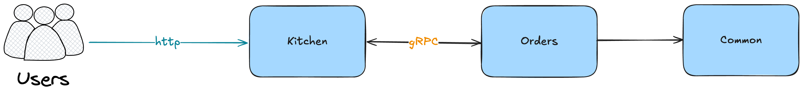

# gRPC Order Service
======================

## Overview

This is a gRPC-based order service written in Go. The service provides a simple API for managing orders, including creating and reading orders.

## Architecture

## Directory Structure

The codebase is organized into the following directories:

* `services`: contains the gRPC services
	+ `orders`: contains the orders service
		- [handler](cci:4:///Users/rishi/Documents/Personal Projects/Golang/gRPC-order/services/orders/handler/orders/grpc.go:0:0-9:0): contains the orders handler
		- [service](cci:4:///Users/rishi/Documents/Personal Projects/Golang/gRPC-order/services/orders/service/orders.go:0:0-9:0): contains the orders service implementation
	+ `kitchen`: contains the kitchen service
* `protobuf`: contains the protocol buffer definitions

## Services

### Orders Service

The orders service provides a gRPC API for managing orders. It includes endpoints for creating, reading, and updating orders.

#### Endpoints

* `CreateOrder`: creates a new order
* `GetOrder`: retrieves an existing order

#### Implementation

The orders service is implemented in the [services/orders/service](cci:7:///Users/rishi/Documents/Personal Projects/Golang/gRPC-order/services/orders/service:0:0-0:0) directory. It uses a simple in-memory database to store orders.

### Kitchen Service

The kitchen service provides a simple web interface for viewing orders.

#### Implementation

The kitchen service is implemented in the [services/kitchen](cci:7:///Users/rishi/Documents/Personal Projects/Golang/gRPC-order/services/kitchen:0:0-0:0) directory. It uses the `net/http` package to serve a simple web page.

## Dependencies

The codebase uses the following dependencies:

* `google.golang.org/grpc`: for gRPC support
* `github.com/Rishi5154/gRPC-order/services/common/genproto/orders`: for generated gRPC code

## Running the Services

To run the services, follow these steps:
1. Generate the proto buffer RPC methods using `make gen` 
2. Run the orders service using the command `make run-orders`
3. Run the kitchen service using the command ` make run-kitchen`

## API Documentation

The API documentation is generated using the `protoc` compiler and the `grpc` plugin. The generated documentation can be found in the `protobuf` directory.